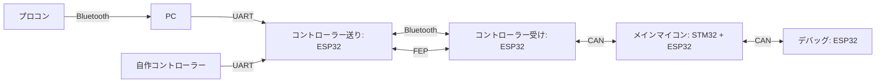

# Network

## Graph

## CAN Bus

## Message ID

| 0 | 1 | 2 | 3 | 4 | 5 | 6 | 7 | 8 | 9 | 10|     Description    |
|:-:|:-:|:-:|:-:|:-:|:-:|:-:|:-:|:-:|:-:|:-:|--------------------|
| 0 | x |   |   |   |   |   |   |   |   |   |ikarashiCAN         |
| 0 | 0 | 1 | 1 | 1 | 1 | 1 | 1 | 1 | 1 | 1 |C620                |
| 0 | 1 | 0 | 0 | 0 | 0 | 0 | 0 | 0 | 0 | 0 |^                   |
| 1 | 0 | 0 | 0 | n |   |   |Dev|   |   |   |Config for (Dev)[n] |
| 1 | 0 | 0 | 1 | n |   |   |Dev|   |   |   |Config Applied      |
| 1 | 0 | 1 | 0 | 0 | 0 | 0 |Dev|   |   |   |Value store[Dev]    |
| 1 | 0 | 1 | 0 | 0 | 0 | 1 |Dev|   |   |   |Report[Dev]         |
| 1 | 0 | 1 | 0 | 0 | 1 | 0 |Dev|   |   |   |Pong from [Dev]     |
| 1 | 0 | 1 | 0 | 0 | 1 | 1 | 0 | 0 | 0 | 0 |Ping                |
| 1 | 0 | 1 | 0 | 0 | 0 | 0 | 0 | 0 | 0 | 1 |Keep Alive          |
| 1 | 1 | 1 | x |   |   |   |   |   |   |   |Stream              |

### Report
#### Data Types

- MDC4
  - Motors
  - Encoders (Angle)
  - Encoders (RPM)

#### General Data Format

| 0 | 1 | 2 | 3 | 4 | 5 | 6 | 7 |
|:--:|:--:|:--:|:--:|:--:|:--:|:--:|:--:|
| ID|>  |>  |>  |>  |>  |> |DATA|

#### ID types

|  0  |  1  |  2  |  3  |  4  |  5  |  6  |  7  |      Description      | 0 | 1 | 2 | 3 | 4 | 5 | 6 | 7 |
|:---:|:---:|:---:|:---:|:---:|:---:|:---:|:---:|-----------------------|:-:|:-:|:-:|:-:|:-:|:-:|:-:|:-:|
| ID  |     |     |     |     |     |     |     | ^                     |   |   |   |   |   |   |   |   |
|  0  |  0  |  0  |  0  |  0  |  ID |     |     | MDC[ID] Speeds        |ID |>|>|>|  Speeds |>|>|   -   |
|  0  |  0  |  0  |  0  |  1  |  ID |     |     | MDC[ID] Angles        | ^ |>|>|>|  Angles |>|>|   -   |
|  0  |  0  |  0  |  1  |  0  |  ID |     |     | MDC[ID] RPMs          | ^ |>|>|>|    RPMs |>|>|   -   |
|  0  |  0  |  0  |  1  |  1  |  ID |     |     | MDC[ID] Currents      | ^ |>|>|>|   Currs |>|>|   -   |
|  0  |  0  |  1  |  0  |  0  |  0  |  0  |  0  | Pong notify           | ^ | i |>  |>  |>  |>  |>  | - |
|  0  |  0  |  1  |  0  |  0  |  0  |  0  |  1  | Status update         | ^ | i |>| stat|>  |>  |>  | - |
|  0  |  0  |  1  |  0  |  0  |  0  |  1  |  x  | N/A                   | ^ |>  |>  |>  |>  |>  |>  | - |
|  0  |  0  |  1  |  0  |  0  |  1  |  x  |  x  | N/A                   | ^ |>  |>  |>  |>  |>  |>  | - |
|  0  |  1  |  0  |  ID |     |     |     |     | PID Gain/FB/Out/Error | ^ | P | I | D | Fb| Ou| Gl| E |
|  0  |  1  |  x  |     |     |     |     |     | N/A                   | ^ |>  |>  |>  |>  |>  |>  | - |
|  1  |  0  |  x  |     |     |     |     |     | N/A                   | ^ |>  |>  |>  |>  |>  |>  | - |
|  1  |  1  |  x  |     |     |     |     |     | N/A                   | ^ |>  |>  |>  |>  |>  |>  | - |

