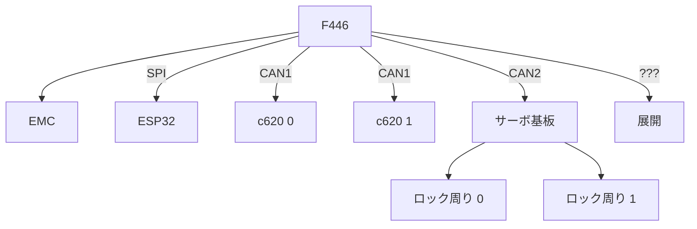

# Robot 2

## ピン配置
```
SW: PC(0,1,2,3)
CAN1: T PA12; R PA11
CAN2: T PB6; R PB5
FEP: Td  PC6; Rd  PC7; Ini PC8; Rst PC9
ENC: PA8, PA9 (A/B: ?)
EMC: PA15
BNO: SCL PB8; SDA PB9; Rst PB0
LED: PB15 PB14 PC10 PC12 PB7 PB4
```

## OCUI (On-Chip User Interface) 割当

### ブート周り

|LED0|LED1|モード|
|:-:|:-:|:-:|
|0|0|テスト 0|
|0|1|テスト 1|
|1|0|テスト 2|
|1|1|実環境コード|


## コントローラー

|部品|機能|種類|
|:-:|:-:|:-:|
|足|移動|ジョイスティック|
|橋|パージ|ボタン|
|橋|アンロック|ボタン|
|橋|巻き上げ|ボタン|

## ブロック図

